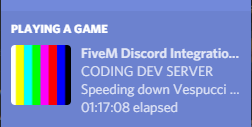

# FiveM Discord Integration

This plugin provides basic player statuses and allows plugins to set 
their own custom statuses easily.



**This plugin has no dependencies! :sparkles:** 

## Features
The plugin will display the following statuses by default:
* Standing on **[Street Name]**
* Running down **[Street Name]**
* Getting into a Vehicle
* Idling on **[Street Name]**
* Speeding down **[Street Name]**

## Configuration
To make the plugin work you will have to create a [Discord App](#) that will 
integrate with the API. Make your changes to **`options.lua`**. When
configured, it will look something like this:

```lua
Options = {
    AppID     = "00000000000000",
    AssetName = "asset_name",
    IconText  = "Text on Icon Hover",
}
``` 

## Integrations
If you want to set your own custom statuses, you can use client events
to set a custom one, and lock if to that if you want to prevent other
plugins from changing it.

### Setting a Custom Status
To set a custom status (that won't change until it is reset), you can
do something along these lines:

```lua
TriggerEvent("discord:setCustom", "Testing a Plugin")
```

### Reset Custom Status
Resetting the status will allow the plugin to display its normal
statuses. **This will also reset the lock!**

```lua
TriggerEvent("discord:resetCustom")
```

### Locking the Status
Lock the status so that other plugins can't change your status. Any attempt
to change the custom status will be ignored until it is unlocked.

```lua
TriggerEvent("discord:lock")
```

### Unlocking the Status
Unlocks the status so that it can be changed by other plugins.

```lua
TriggerEvent("discord:unlock")
```

## License
This project is licensed under the MIT license.